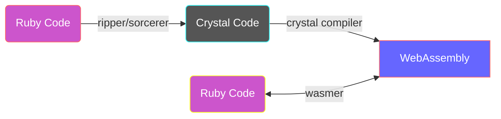

# cry_wasm

cry_wasm speeds up [Ruby](https://github.com/ruby/ruby) code.

By applying simple type restrictions to Ruby code, convert it to [Crystal](https://github.com/crystal-lang/crystal) code, compile it to [WebAssembly](https://webassembly.org/), and call it with [Wasmer](https://github.com/wasmerio/wasmer).



:space_invader: _highly experimental_

## Quick Start

```ruby
require 'cry_wasm'

class Fibonacci
  extend CryWasm              # <-- Extend CryWasm module

  def initialize; end

  cry [:Int32], :Int32        # <-- Set crystal [argument], return types
  def fib(n)
    if n <= 1
      1
    else
      fib(n - 1) + fib(n - 2)
    end
  end

  cry_wasm                    # <-- Crystal compiles the fib method into Wasm.
end

Fibonacci.new.fib(40)         # <-- The wasm function is called here!
```

## Benchmark

[fib_bench.rb](https://github.com/kojix2/cry_wasm/blob/main/examples/fib_bench.rb) - 10 x faster on the [Fibonacci benchmark](https://crystal-lang.org/2016/07/15/fibonacci-benchmark/).

```
                 user     system      total        real
fib_ruby(40)  7.461878   0.004760   7.466638 (  7.466798)
fib_wasm(40)  0.628013   0.000025   0.628038 (  0.628096)
```


## How does this work?

1. Extend the CryWasm module to the target class.
1. Write the type information just before the method.
   1. Use `cry` method to restrict argument types and return types
1. Once the method is defined, CryWasm captures the source code.
   1. [Ripper](https://ruby-doc.org/stdlib-3.1.2/libdoc/ripper/rdoc/Ripper.html) converts source code to S-expressions.
   1. The S exp of the target method is extracted from the S-expression.
   1. The S exp of the target method is recovered to the source code by [Sorcerer](https://github.com/rspec-given/sorcerer).
   1. The Crystal type restriction is added and becomes a Crystal code block.
   1. CryWasm stock the crystal code block.
1. The Crystal compiler compiles the Crystal code into WebAssembly.
   1. Call `cry_wasm` method to build the crystal code blocks.
1. The compiled byte_code is loaded and an instance of Wasmer is created.
1. The target method is dynamically redefined to call a Wasmer function.

## Limitations

- CryWasm allows you to define functions, not Crystal methods
  - default arguments, keyword arguments, and block arguments are not available.
- Currently, only numbers are accepted as arguments. In the future, strings may also be acceptable.

## Installation

Install [Crystal](https://github.com/crystal-lang/crystal).

```sh
# Not yet available. Please see development section.
gem install cry_wasm
```

## Development

- [Trying out WASM Support](https://forum.crystal-lang.org/t/trying-out-wasm-support/4508/48) - A thread in the Crystal Forum on how to compile a wasm from crystal.
- [wasm-libs](https://github.com/lbguilherme/wasm-libs) - WebAssembly Libs for WASI. You need to download the compiled wasm library.

```
git clone https://github.com/kojix2/cry_wasm
cd cry_wasm
./download-wasm-libs.sh
bundle exec ruby examples/fibonacci.rb
# rake install
```

- [Crystal で WebAssembly に出力した関数を Ruby から呼び出す](https://qiita.com/kojix2/items/b233f1419b26f7fc0e1b)

## license

MIT
