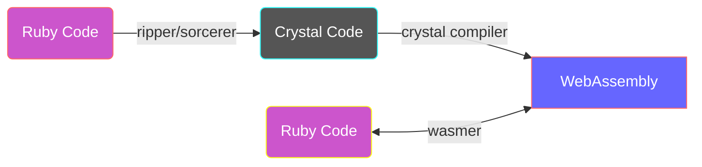

# cry_wasm

cry_wasm speeds up [Ruby](https://github.com/ruby/ruby) code.

By applying simple type restrictions to Ruby code, convert it to [Crystal](https://github.com/crystal-lang/crystal) code, compile it to [WebAssembly](https://webassembly.org/), and call it with [Wasmer](https://github.com/wasmerio/wasmer).



:space_invader: *experimental*

## Quick Start

```ruby
require 'cry_wasm'

class Fibonacci
  extend CryWasm

  def initialize; end

  cry [:Int32], :Int32
  def fib(n)
    if n <= 1
      1
    else
      fib(n - 1) + fib(n - 2)
    end
  end
  alias fib_ruby fib

  cry_wasm
end

Fibonacci.new.fib(40)
```

## How does this work?

1. Extend the CryWasm module to the target class.
1. Write the type information just before the method.
    1. Use `cry` method to restrict argument types and return types
1. Once the method is defined, CryWasm captures the source code.
    1. Ripper converts source code to S-expressions.
    1. The S exp of the target method is extracted from the S-expression. 
    1. The S exp of the target method is recovered to the source code by Sorcerer.
    1. The Crystal type restriction is added and becomes a Crystal code block.
    1. CryWasm stock the crystal code block.
1. The Crystal compiler compiles the Crystal code into WebAssembly.
    1. Call `cry_wasm` method to build the crystal code blocks.
1. The compiled byte_code is loaded and an instance of Wasmer is created.
1. The target method is dynamically redefined to call a Wasmer function.

Currently, only numbers are accepted as arguments. In the future, strings will also be acceptable.

## Installation

Install [crystal](https://github.com/crystal-lang/crystal).

```sh
# Not yet available.
gem install cry_wasm
```

## Development

- [Trying out WASM Support](https://forum.crystal-lang.org/t/trying-out-wasm-support/4508/48) - A thread in the Crystal Forum on how to compile a wasm from crystal.

```
git clone https://github.com/kojix2/cry_wasm
cd cry_wasm
./download-wasm-libs.sh
bundle exec ruby examples/fibonacci.rb
# rake install
```

- [CrystalでWebAssemblyに出力した関数をRubyから呼び出す](https://qiita.com/kojix2/items/b233f1419b26f7fc0e1b)

## license

MIT

This Gem contains the code of the following projects.
The former is MIT. The latter is the library needed to build Wasm in Crystal.

* [sorcerer](https://github.com/rspec-given/sorcerer)
* [wasm-libs](https://github.com/lbguilherme/wasm-libs)
