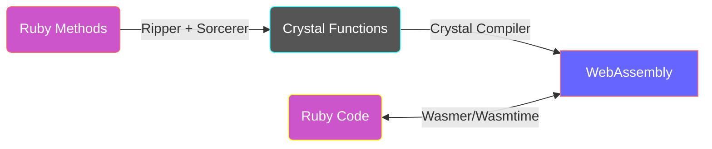

# cry-wasm

[](https://github.com/kojix2/cry-wasm/actions/workflows/ci.yml)
[](https://kojix2.github.io/cry-wasm/)

:zap: cry-wasm speeds up [Ruby](https://github.com/ruby/ruby) code.

By applying simple type restrictions to Ruby code, convert it to [Crystal](https://github.com/crystal-lang/crystal) code, compile it to [WebAssembly](https://webassembly.org/), and call it with [Wasmer](https://github.com/wasmerio/wasmer) or [Wasmtime](https://github.com/bytecodealliance/wasmtime).

<div align="center"></div>

:space_invader: experimental

## Quick Start

```ruby
require 'cry/wasm'

class Fibonacci
  extend Cry::Wasm            # (1) Extend your class

  cry [:Int32], :Int32        # (2) Write type signatures
  def fib(n)
  　return 1 if n <= 2
    fib(n - 1) + fib(n - 2)
  end

  cry_wasm                    # (3) Compile Wasm
end

Fibonacci.new.fib(40)         # (4) Call Wasm Function
```

1. Extend Cry::Wasm module to your Ruby class.
2. Write Crystal type signatures for Ruby methods. The syntax is `[arg_t1, arg_t2], ret_t`
3. Crystal compiler compile the Ruby methods into WebAssembly as Crystal functions.
4. Finally, call the wasm function!

## Benchmark

[fib_bench.rb](https://github.com/kojix2/cry-wasm/blob/main/examples/fib_bench.rb) - 10 x faster on the [Fibonacci benchmark](https://crystal-lang.org/2016/07/15/fibonacci-benchmark/).

```
                       user     system      total        real
ruby     fib(40)   5.305503   0.000000   5.305503 (  5.305696)
wasmtime fib(40)   0.462232   0.000000   0.462232 (  0.462247)
wasmer   fib(40)   0.381384   0.000000   0.381384 (  0.381401)
```


- In this benchmark, Wasmer is about 10% faster than Wasmtime as of December 2022.
- Both Wasmer and Wasmtime tend to take a little longer for the first call. (see line graph at n=1)
- Wasm is only about twice as slow as native functions, making it highly efficient. (according to my measurements)

## How does this work?



1. Extend the Cry::Wasm module to the target class.
1. Write the type information just before the method.
   1. Use the `cry` method to restrict argument types and return types.
1. Once the method is defined, Cry::Wasm captures the source code.
   1. [Ripper](https://ruby-doc.org/stdlib-3.1.2/libdoc/ripper/rdoc/Ripper.html) converts source code to [S-expression](https://en.wikipedia.org/wiki/S-expression).
   1. Extracts the S-expression of the target method from the S-expression.
   1. [Sorcerer](https://github.com/rspec-given/sorcerer) recovers the Ruby source code of the target method from the S-expression.
   1. Add Crystal type restrictions to the Ruby source code to generate a Crystal code block.
   1. Cry::Wasm stores the Crystal code block.
1. The Crystal compiler and wasm-ld compile the Crystal code into WebAssembly.
   1. Call the `cry_wasm` method to build the crystal code blocks.
1. The compiled byte_code is read, and an instance of Wasmer/Wasmtime is created.
1. The target methods are dynamically redefined to call Wasmer/Wasmtime functions.

## Limitations

- Cry::Wasm only allows you to define functions, not Crystal methods.
  - Default arguments, keyword arguments, and block arguments are not available.
  - Instance variables and class variables are not available.
- Garbage collection is not supported and is unlikely to be supported in the future.

## Type conversion

### Arguments - Ruby --> Crystal

| Ruby class       | Crystal class                                                                                                             |
| ---------------- | ------------------------------------------------------------------------------------------------------------------------- |
| `Integer`        | `UInt8` `Int8` `UInt16` `Int16` `UInt32` `Int32` `UInt64` `Int64`                                                         |
| `Float`          | `Float32` `Float64`                                                                                                       |
| `Array<Integer>` | `UInt8*` `Int8*` `UInt16*` `Int16*` `UInt32*` `Int32*` `UInt64*` `Int64*`                                                 |
| `Array<Integer>` | `Array(UInt8)` `Array(Int8)` `Array(UInt16)` `Array(Int16)` `Array(UInt32)` `Array(Int32)` `Array(UInt64)` `Array(Int64)` |
| `Array<Float>`   | `Float32*` `Float64*`                                                                                                     |
| `Array<Float>`   | `Array(Float32)` `Array(Float32)`                                                                                         |
| `String`         | `String`                                                                                                                  |

### Return values - Crystal --> Ruby

| Crystal class                                                                                                             | Ruby class                          |
| ------------------------------------------------------------------------------------------------------------------------- | ----------------------------------- |
| `UInt8` `Int8` `UInt16` `Int16` `UInt32` `Int32` `UInt64` `Int64`                                                         | `Integer`                           |
| `Float32` `Float64`                                                                                                       | `Float`                             |
| `UInt8*` `Int8*` `UInt16*` `Int16*` `UInt32*` `Int32*`                                                                    | View object of Wasmer (wasmer only) |
| `Array(UInt8)` `Array(Int8)` `Array(UInt16)` `Array(Int16)` `Array(UInt32)` `Array(Int32)` `Array(UInt64)` `Array(Int64)` | `Array<Integer>`                    |
| `Array(Float32)` `Array(Float32)`                                                                                         | `Array<Float>`                      |
| `String`                                                                                                                  | `String`                            |
| `Void`                                                                                                                    | `Nil`                               |

Note: Why is `Symbol` not supported?
In the Crystal language, Symbol is converted to an integer at compile time, so there is no way to get Symbol from a String; use `String` instead of `Symbol`.

## Installation

Requirements

1. [Crystal](https://github.com/crystal-lang/crystal) - Follow the installation instructions [here](https://crystal-lang.org/install/) for your platform.
1. [Rust](https://www.rust-lang.org/) - Rust is required to compile the [wasmer-ruby](https://github.com/wasmerio/wasmer-ruby) or [wasmtime-rb](https://github.com/bytecodealliance/wasmtime-rb).
1. [LLVM](https://llvm.org/) for macOS:
   1. Install LLVM by running `brew install llvm`
   1. Find the path to wasm-ld by running `brew ls llvm | grep wasm-ld`.
   1. Set the PATH environment variable so that `wasm-ld` can be called.
1. [LLD](https://lld.llvm.org/) for Ubuntu:
   1. Install LLD by running `sudo apt install lld`.
   1. Find the path to wasm-ld by running `dpkg -L lld | grep wasm-ld`.
   1. If necessary, create a symbolic link for `wasm-ld-9` or `wasm-ld-10`.
1. [WebAssembly Libs for WASI](https://github.com/lbguilherme/wasm-libs)
   1. Use the `rake vendor:wasi_libs` task to download the libs to the vendor directory.
   1. If you install the libs outside the given directory, set the `CRYSTAL_LIBRARY_PATH` environment variable.

Installation

```
bundle install
bundle exec rake install
```

Please note that cry-wasm depends on the latest API of wasmer-ruby and wasmtime-rb, so we have to use the GitHub master rather than the stable version.

Tested on macOS and Ubuntu using [Github Actions](https://github.com/kojix2/cry-wasm/blob/main/.github/workflows/ci.yml).

## Development

```
git clone https://github.com/kojix2/cry-wasm
cd cry-wasm
bundle install
bundle exec rake vendor:wasi_libs
bundle exec rake spec
```

- [Trying out WASM Support](https://forum.crystal-lang.org/t/trying-out-wasm-support/4508) - A thread in the Crystal Forum on how to compile a wasm from crystal.
- [wasm-libs](https://github.com/lbguilherme/wasm-libs) - WebAssembly Libs for WASI. You need to download the compiled wasm library.

Even small improvements like fixing typos are welcome! Please feel free to send us your PR.

## license

MIT
