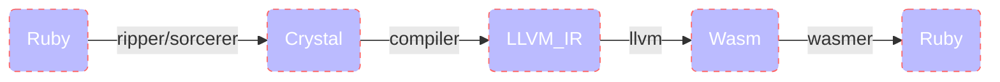

# CryWasm

Ruby code is converted to Crystal at runtime and compiled into Wasm. ruby calls Wasm functions in wasmer. This is a prototype created to show that this concept works in practice.



<div align="center">
  
</div>

## Installation

Install [crystal](https://github.com/crystal-lang/crystal).

```sh
# Not yet available.
gem install cry_wasm
```

## Development

```
git clone https://github.com/kojix2/cry_wasm
cd cry_wasm
./download-wasm-libs.sh
bundle exec ruby examples/fibonacci.rb
# rake install
```

## How does this work?

1. Extend the CryWasm module to the target class.
1. Write the type information just before the method.
    1. Use `cry` method to restrict argument types and return types
1. Once the method is defined, CryWasm captures the source code.
    1. Ripper converts source code to S-expressions.
    1. The S exp of the target method is extracted from the S-expression. 
    1. The S exp of the target method is returned to the source code by Sorcerer.
    1. The Crystal type restriction is added and becomes a Crystal code block.
    1. The Crystal code block is stocked.
1. The Crystal compiler compiles the Crystal code into WebAssembly.
    1. Use `cry_wasm` method to build the crystal code blocks.
1. The compiled byte_code is loaded on the fly and an instance of Wasmer is created.
1. Methods are redefined to call Wasmer functions.

Currently, only numbers are accepted as arguments. In the future, strings will also be acceptable.
## license

MIT

This Gem contains the code of the following projects.
The former is MIT. The latter is the library needed to build Wasm in Crystal.

* [sorcerer](https://github.com/rspec-given/sorcerer)
* [wasm-libs](https://github.com/lbguilherme/wasm-libs)
