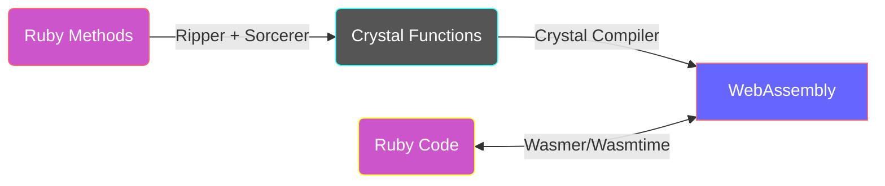

# cry-wasm

[](https://github.com/kojix2/cry-wasm/actions/workflows/ci.yml)
[](https://kojix2.github.io/cry-wasm/)

cry-wasm speeds up [Ruby](https://github.com/ruby/ruby) code.

By applying simple type restrictions to Ruby code, convert it to [Crystal](https://github.com/crystal-lang/crystal) code, compile it to [WebAssembly](https://webassembly.org/), and call it with [Wasmer](https://github.com/wasmerio/wasmer) or [Wasmtime](https://github.com/bytecodealliance/wasmtime).

<div align="center"></div>

:space_invader: _highly experimental_

## Quick Start

```ruby
require 'cry/wasm'

class Fibonacci
  extend Cry::Wasm            # <-- (1) Extend your class

  cry [:Int32], :Int32        # <-- (2) Write signature
  def fib(n)
    if n <= 1
      1
    else
      fib(n - 1) + fib(n - 2)
    end
  end

  cry_wasm                    # <-- (3) Compile Wasm
end

Fibonacci.new.fib(40)         # <-- (4) Call Wasm
```

1. Extend Cry::Wasm module to your Ruby class.
2. Write Crystal type signatures for Ruby methods. The syntax is `[arg_t1, arg_t2], ret_t`
3. Crystal compiler compile the Ruby methods into WebAssembly as Crystal functions.
4. Finally, call the wasm function!

## Benchmark

[fib_bench.rb](https://github.com/kojix2/cry-wasm/blob/main/examples/fib_bench.rb) - 10 x faster on the [Fibonacci benchmark](https://crystal-lang.org/2016/07/15/fibonacci-benchmark/).

```
                 user     system      total        real
fib_ruby(40)  7.461878   0.004760   7.466638 (  7.466798)
fib_wasm(40)  0.628013   0.000025   0.628038 (  0.628096)
```


As of December 2022, Wasmer seems to be about 10% faster than Wasmtime. Wasm is fast, but slower than native shared libraries. In my measurement, wasm is about 2 times slower.

## How does this work?



1. Extend the Cry::Wasm module to the target class.
1. Write the type information just before the method.
   1. Use the `cry` method to restrict argument types and return types.
1. Once the method is defined, Cry::Wasm captures the source code.
   1. [Ripper](https://ruby-doc.org/stdlib-3.1.2/libdoc/ripper/rdoc/Ripper.html) converts source code to [S-expression](https://en.wikipedia.org/wiki/S-expression).
   1. Extracts the S-expression of the target method from the S-expression.
   1. [Sorcerer](https://github.com/rspec-given/sorcerer) recovers the Ruby source code of the target method from the S-expression.
   1. Add Crystal type restrictions to the Ruby source code to generate a Crystal code block.
   1. Cry::Wasm stores the Crystal code block.
1. The Crystal compiler and wasm-ld compile the Crystal code into WebAssembly.
   1. Call the `cry_wasm` method to build the crystal code blocks.
1. The compiled byte_code is read, and an instance of Wasmer is created.
1. The target methods are dynamically redefined to call Wasmer functions.

## Limitations

- Cry::Wasm only allows you to define functions, not Crystal methods.
  - Default arguments, keyword arguments, and block arguments are not available.
  - Instance variables and class variables are not available.
- Garbage collection is not supported and is unlikely to be supported in the future.

## Type conversion

:construction: work in progress :pick: 

Currently, only numbers are accepted as arguments. In the future, strings may also be acceptable.

### Arguments - Ruby --> Crystal

|Ruby class|Crystal class|
|---|---|
|`Integer`|`UInt8` `Int8` `UInt16` `Int16` `UInt32` `Int32` `UInt64` `Int64`|
|`Float`|`Float32` `Float64`|
|`Array<Integer>`|`UInt8*` `Int8*` `UInt16*` `Int16*` `UInt32*` `Int32*` `UInt64*` `Int64*`|
|`Array<Integer>`|`Array(UInt8)` `Array(Int8)` `Array(UInt16)` `Array(Int16)` `Array(UInt32)` `Array(Int32)` `Array(UInt64)` `Array(Int64)`|
|`Array<Float>`|`Float32*` `Float64*`|
|`Array<Float>`|`Array(Float32)` `Array(Float32)`|

### Return values - Crystal --> Ruby

|Crystal class|Ruby class|
|---|---|
|`UInt8` `Int8` `UInt16` `Int16` `UInt32` `Int32` `UInt64` `Int64`|`Integer`|
|`Float32` `Float64`|`Float`|
|`UInt8*` `Int8*` `UInt16*` `Int16*` `UInt32*` `Int32*`|View object of Wasmer (wasmer only)|
|`Array(UInt8)` `Array(Int8)` `Array(UInt16)` `Array(Int16)` `Array(UInt32)` `Array(Int32)` `Array(UInt64)` `Array(Int64)`|`Array<Integer>`|
|`Array(Float32)` `Array(Float32)`|`Array<Float>`|
|`Void`|`Nil`|

## Installation

1. Install [Crystal](https://github.com/crystal-lang/crystal). Installation instructions for each platform are [here](https://crystal-lang.org/install/).
1. Install [Rust](https://www.rust-lang.org/). Rust is required to compile the [wasmer gem](https://github.com/wasmerio/wasmer-ruby). 
1. Install llvm for macOS and lld for Ubuntu. Set PATH so that `wasm-ld` can be called.
    1. For example, if you install llvm on macOS with homebrew, `PATH="/usr/local/opt/llvm/bin:$PATH"` or `PATH="/opt/homebrew/Cellar/llvm/<version>/bin:$PATH"`
1. Download [WebAssembly Libs for WASI](https://github.com/lbguilherme/wasm-libs) with `rake vendor:wasi_libs`
1. Run `bundle install`. Because cry-wasm depends on the latest API, we use the github master of wasmer-ruby and wasmtime.

```sh
# Not yet available. Please see development section.
gem install cry/wasm
```

Tested on macOS and Ubuntu using [Github Actions](https://github.com/kojix2/cry-wasm/blob/main/.github/workflows/ci.yml).

## Development

- [Trying out WASM Support](https://forum.crystal-lang.org/t/trying-out-wasm-support/4508) - A thread in the Crystal Forum on how to compile a wasm from crystal.
- [wasm-libs](https://github.com/lbguilherme/wasm-libs) - WebAssembly Libs for WASI. You need to download the compiled wasm library.

```
git clone https://github.com/kojix2/cry-wasm
cd cry-wasm
bundle install
bundle exec rake vendor:wasi_libs
bundle exec ruby examples/fibonacci.rb
# rake install
```

- [Crystal で WebAssembly に出力した関数を Ruby から呼び出す](https://qiita.com/kojix2/items/b233f1419b26f7fc0e1b)

## license

MIT
