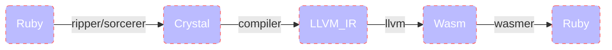

# CryWasm



<div align="center">
  
</div>

## Development

Install crystal.
Then: 

```
git clone https://github.com/kojix2/crywasm
cd crywasm
./download-wasm-libs.sh
bundle exec ruby examples/fibonacci.rb
# rake install
```

## license

MIT

This Gem contains the code of the following projects.
The former is MIT. The latter is the library needed to build Wasm in Crystal.

* [sorcerer](https://github.com/rspec-given/sorcerer)
* [wasm-libs](https://github.com/lbguilherme/wasm-libs)
